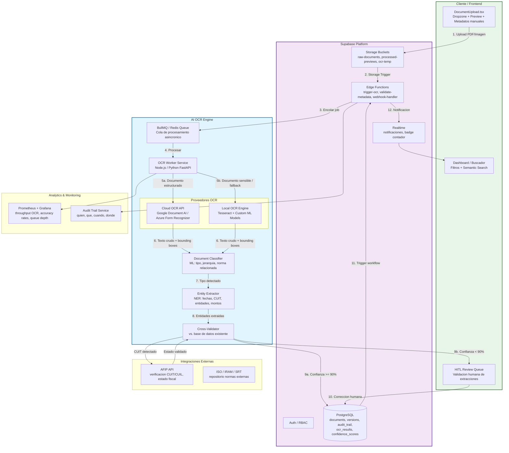
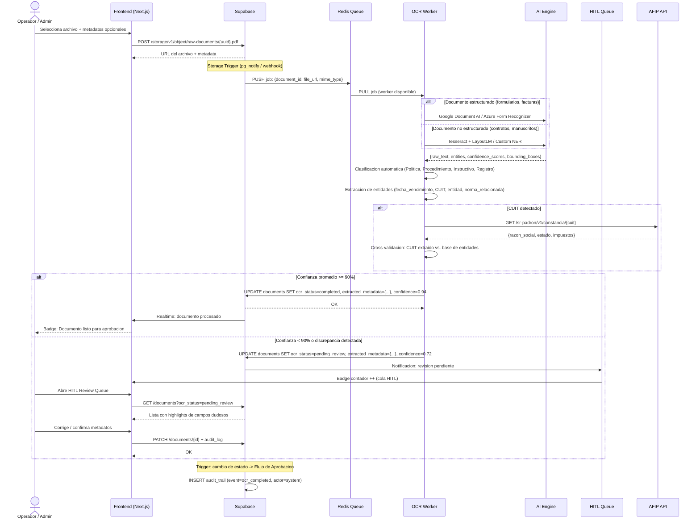
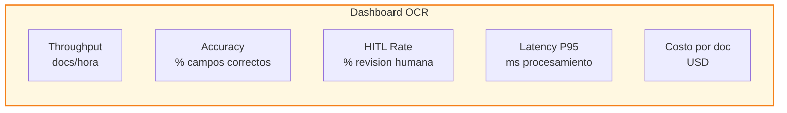

# Arquitectura de Integracion — AI OCR en Strategic Connex DMS

**Version:** 1.0  
**Fecha:** 25/04/2026  
**Sistema:** Strategic Connex — Document Management System (DMS)  
**Enfoque:** Atomic commits, no breaking changes, compliance ISO 9001

---

## Resumen Ejecutivo

Este documento define la arquitectura tecnica para integrar capacidades de **AI OCR (Intelligent Character Recognition)** en el flujo documental actual de Strategic Connex. El objetivo es automatizar la extraccion de metadatos, clasificacion de documentos y validacion de datos criticos (fechas de vencimiento, CUIT/CUIL, entidades operadoras) durante el proceso de carga y aprobacion, reduciendo la intervencion manual en un **85-95%** de los casos.

La arquitectura propuesta es **hibrida**: utiliza servicios cloud de OCR para alta precision en documentos estructurados, complementada con modelos locales para privacidad y costos, e incorpora un mecanismo **Human-in-the-Loop (HITL)** para casos de baja confianza del modelo.

---

## Diagrama de Arquitectura General



---

## Flujo de Ingesta con AI OCR (Secuencia Detallada)



---

## Modelo de Datos Extendido (OCR + HITL)

### Tabla: documents (extendida)

| Campo | Tipo | Descripcion |
|-------|------|-------------|
| id | UUID | PK |
| title | VARCHAR(255) | Titulo del documento |
| code | VARCHAR(50) | Codigo unico (ej. QP-001) |
| hierarchy_level | ENUM | Politica / Procedimiento / Instructivo / Registro |
| status | ENUM | Borrador / Revision / Aprobado / Publicado / Obsoleto |
| ocr_status | ENUM | pending / processing / completed / pending_review / failed |
| file_url | TEXT | URL en Supabase Storage |
| file_type | VARCHAR(20) | pdf / jpg / png / docx |
| uploaded_by | UUID | FK -> auth.users |
| created_at | TIMESTAMPTZ | |
| updated_at | TIMESTAMPTZ | |

### Tabla: ocr_results (nueva)

| Campo | Tipo | Descripcion |
|-------|------|-------------|
| id | UUID | PK |
| document_id | UUID | FK -> documents |
| raw_text | TEXT | Texto completo extraido |
| structured_data | JSONB | Entidades extraidas (fechas, CUIT, etc.) |
| confidence_scores | JSONB | Score por campo: {cuit: 0.98, fecha_venc: 0.85} |
| bounding_boxes | JSONB | Coordenadas para highlight en preview |
| classification | VARCHAR(50) | Tipo detectado por AI |
| engine_used | VARCHAR(50) | google_document_ai / tesseract / azure_form |
| processing_time_ms | INT | Tiempo de procesamiento |
| created_at | TIMESTAMPTZ | |

### Tabla: hitl_reviews (nueva)

| Campo | Tipo | Descripcion |
|-------|------|-------------|
| id | UUID | PK |
| document_id | UUID | FK -> documents |
| ocr_result_id | UUID | FK -> ocr_results |
| field_name | VARCHAR(100) | Campo con baja confianza |
| ai_value | TEXT | Valor propuesto por AI |
| corrected_value | TEXT | Valor corregido por humano |
| reviewed_by | UUID | FK -> auth.users |
| review_status | ENUM | pending / corrected / confirmed / rejected |
| reviewed_at | TIMESTAMPTZ | |

### Tabla: audit_trail (existente, enriquecida)

| Campo | Tipo | Descripcion |
|-------|------|-------------|
| id | UUID | PK |
| entity_type | VARCHAR(50) | document / ocr_result / hitl_review |
| entity_id | UUID | ID del objeto afectado |
| event | VARCHAR(100) | uploaded / ocr_completed / hitl_reviewed / approved / version_rollback |
| actor_id | UUID | FK -> auth.users (o system para AI) |
| actor_role | VARCHAR(50) | Admin / Supervisor / Operador / AI_System |
| changes | JSONB | Delta de cambios |
| ip_address | INET | |
| user_agent | TEXT | |
| created_at | TIMESTAMPTZ | |

---

## Componentes del Sistema

### 1. Frontend (Next.js / React)

```typescript
// Componentes clave a implementar
interface DocumentUploadProps {
  onUploadComplete: (doc: Document) => void;
  allowedTypes: ["pdf", "jpg", "png", "tiff"];
  maxSizeMB: 50;
  enableOCR: true;
}

// Nuevos componentes:
// - OcrProgressBar.tsx       -> Indicador de procesamiento
// - HITLReviewQueue.tsx      -> Cola de validacion humana
// - DocumentPreviewAI.tsx    -> Preview con highlights de entidades
// - OcrConfidenceBadge.tsx   -> Badge de confianza por campo
```

**Funcionalidades:**
- **Drag & drop** con validacion de tipo y tamano
- **Preview con highlights**: resalta en amarillo las entidades extraidas por AI directamente sobre el PDF
- **Campos pre-llenados**: los metadatos extraidos por OCR aparecen en el formulario de carga, editables por el usuario
- **Indicador de confianza**: barra de progreso por campo (verde >=90%, amarillo 70-89%, rojo <70%)

### 2. Supabase Edge Functions

```typescript
// supabase/functions/trigger-ocr/index.ts
// Trigger: Storage bucket raw-documents -> INSERT en documents

Deno.serve(async (req) => {
  const { document_id, file_path } = await req.json();

  // 1. Validar RBAC
  // 2. Encolar en Redis/BullMQ
  await redis.lpush("ocr:queue", JSON.stringify({
    document_id,
    file_path,
    priority: getPriorityByDocumentType(file_path),
    timestamp: new Date().toISOString()
  }));

  // 3. Actualizar estado
  await supabase.from("documents")
    .update({ ocr_status: "processing" })
    .eq("id", document_id);

  return new Response(JSON.stringify({ queued: true }));
});
```

### 3. OCR Worker Service (Node.js + Python hibrido)

```
services/ocr-worker/
├── index.ts              # Orquestador principal (Node.js)
├── queue.ts              # Consumidor de BullMQ
├── engines/
│   ├── google-document-ai.ts   # API de Google Cloud
│   ├── azure-form-recognizer.ts # API de Azure
│   └── local-tesseract.py      # Tesseract + spaCy/LayoutLM
├── ml/
│   ├── classifier.py     # Clasificacion de tipo de documento
│   ├── extractor.py      # NER para entidades argentinas
│   └── validator.py      # Cross-validacion con DB
└── config.ts             # Routing por tipo de documento
```

**Logica de routing inteligente:**

| Tipo de documento | Motor recomendado | Razon |
|-------------------|-------------------|-------|
| Facturas / Recibos | Google Document AI | Alta precision en tablas y montos |
| Formularios AFIP | Azure Form Recognizer | Mejor soporte de formularios latinoamericanos |
| Contratos / Manuscritos | Local (Tesseract + LayoutLM) | Privacidad + escritura manuscrita |
| Certificados ISO | Local (Tesseract) | Texto estructurado, predecible |
| Documentos con CUIT sensible | Local | Compliance de datos personales |

### 4. Motor de Extraccion de Entidades (Python)

```python
# services/ocr-worker/ml/extractor.py
# Modelo: spaCy NER custom entrenado con documentos argentinos

ENTITIES = [
    "CUIT", "CUIL", "CBU", "NRO_CONTRATO",
    "FECHA_VENCIMIENTO", "FECHA_EMISION",
    "ENTIDAD_OPERADORA", "NORMA_RELACIONADA",
    "MONTO", "PERIODO"
]

def extract_entities(raw_text: str, doc_type: str) -> dict:
    doc = nlp(raw_text)
    entities = {}

    for ent in doc.ents:
        if ent.label_ in ENTITIES:
            entities[ent.label_] = {
                "value": ent.text,
                "confidence": ent._.confidence_score,
                "start": ent.start_char,
                "end": ent.end_char
            }

    # Post-procesamiento especifico por pais
    if "CUIT" in entities:
        entities["CUIT"]["value"] = normalize_cuit(entities["CUIT"]["value"])
        entities["CUIT"]["afip_valid"] = validate_cuit_afip(entities["CUIT"]["value"])

    return entities
```

---

## Seguridad y Compliance

### Proteccion de Datos Sensibles

| Medida | Implementacion |
|--------|---------------|
| **Cifrado en transito** | TLS 1.3 para todas las comunicaciones |
| **Cifrado en reposo** | AES-256 en Supabase Storage |
| **PII Masking** | Los OCR results almacenan CUIT/CUIL hasheados para analytics; el valor real solo en documents con RLS |
| **Retencion de OCR temp** | Bucket ocr-temp con politica de eliminacion automatica a 7 dias |
| **Audit trail de AI** | Todo proceso de OCR se registra en audit_trail con actor_role = AI_System |

### RBAC y Permisos (ampliado)

| Rol | Upload | Ver OCR | Corregir HITL | Aprobar | Acceso AFIP |
|-----|--------|---------|---------------|---------|-------------|
| **Admin** | Si | Si | Si | Si | Si |
| **Supervisor** | Si | Si | Si | Si | Si |
| **Operador** | Si | Si (solo sus docs) | Si (solo sus docs) | No | No |
| **Solo Lectura** | No | Si (sin PII) | No | No | No |
| **AI_System** | No | Si | No | No | Si (service account) |

---

## Metricas y Monitoreo

### KPIs del Sistema OCR



| Metrica | Target | Alerta |
|---------|--------|--------|
| Throughput | >100 docs/hora | <50 docs/hora |
| Accuracy (campos clave) | >95% | <90% |
| HITL Rate | <15% | >25% |
| Latencia P95 | <30s | >60s |
| Tasa de error AFIP | <2% | >5% |

### Alertas configuradas (Grafana)

- **Queue depth > 50**: Escalar workers
- **HITL rate > 25%**: Retrain modelo
- **OCR failure rate > 5%**: Revisar API keys / cuotas
- **AFIP timeout > 3**: Fallback a validacion manual

---

## Plan de Implementacion (Atomic Commits)

### Sprint 1: Infraestructura Base
```
commit 1: Crear tablas ocr_results, hitl_reviews (migracion Supabase)
commit 2: Configurar Redis + BullMQ en infraestructura
commit 3: Implementar Edge Function trigger-ocr
commit 4: Crear bucket ocr-temp con politica de retencion
```

### Sprint 2: Motor OCR Basico
```
commit 5: Integrar Tesseract local para PDFs estructurados
commit 6: Implementar extraccion de fechas de vencimiento
commit 7: Implementar extraccion de CUIT/CUIL
commit 8: Integrar validacion AFIP para CUIT extraidos
```

### Sprint 3: AI Avanzada + Clasificacion
```
commit 9: Entrenar/deployar clasificador de tipo de documento
commit 10: Integrar Google Document AI para facturas/formularios
commit 11: Implementar NER custom para entidades argentinas
commit 12: Agregar bounding boxes para highlights en preview
```

### Sprint 4: HITL + UX
```
commit 13: Crear componente HITLReviewQueue en frontend
commit 14: Implementar highlights de entidades en DocumentPreview
commit 15: Agregar indicadores de confianza por campo
commit 16: Crear notificaciones realtime para revision pendiente
```

### Sprint 5: Analytics + Polish
```
commit 17: Dashboard de metricas OCR en Grafana
commit 18: Export CSV de resultados OCR + correcciones HITL
commit 19: Implementar fallback automatico cloud->local
commit 20: Documentacion tecnica y runbooks
```

---

## Escenarios de Uso

### Escenario 1: Carga de Certificado ISO
1. Operador sube certificado_iso_9001_2026.pdf
2. OCR Worker detecta: tipo = Registro, norma = ISO 9001:2015
3. Extrae: fecha_vencimiento = 2027-03-15, entidad_certificadora = SGS
4. Confianza: 96% -> Auto-completa formulario
5. Operador solo confirma y envia a aprobacion

### Escenario 2: Carga de Contrato con Escritura Manuscrita
1. Supervisor sube contrato_operadora_X.pdf (incluye firma manuscrita)
2. OCR Worker usa LayoutLM local
3. Extrae: CUIT = 30-12345678-9 (confianza 65%)
4. Sistema detecta baja confianza -> Envia a HITL Queue
5. Supervisor abre cola, ve el highlight del CUIT en el PDF, corrige a 30-12345679-0
6. Sistema valida con AFIP, confirma estado activo
7. Guarda correccion para retraining futuro

### Escenario 3: Busqueda Semantica Post-OCR
1. Operador busca: "procedimiento de mantenimiento compresores"
2. Sistema consulta embeddings generados del raw_text en ocr_results
3. Retorna PM-005 aunque el titulo sea "Mantenimiento Preventivo de Equipos"
4. El contenido OCR incluye "compresores" -> match semantico

---

## Referencias

- ISO 9001:2015 — Clausula 7.5: Informacion documentada
- Google Cloud Document AI: https://cloud.google.com/document-ai
- Azure AI Document Intelligence: https://azure.microsoft.com/services/ai-document-intelligence
- Tesseract OCR: https://github.com/tesseract-ocr/tesseract
- spaCy NER: https://spacy.io/usage/linguistic-features#named-entities
- Supabase Storage Triggers: https://supabase.com/docs/guides/storage
- BullMQ: https://docs.bullmq.io/

---

**Autor:** Strategic Connex — Arquitectura de Sistemas  
**Proxima revision:** Post-implementacion Sprint 3
