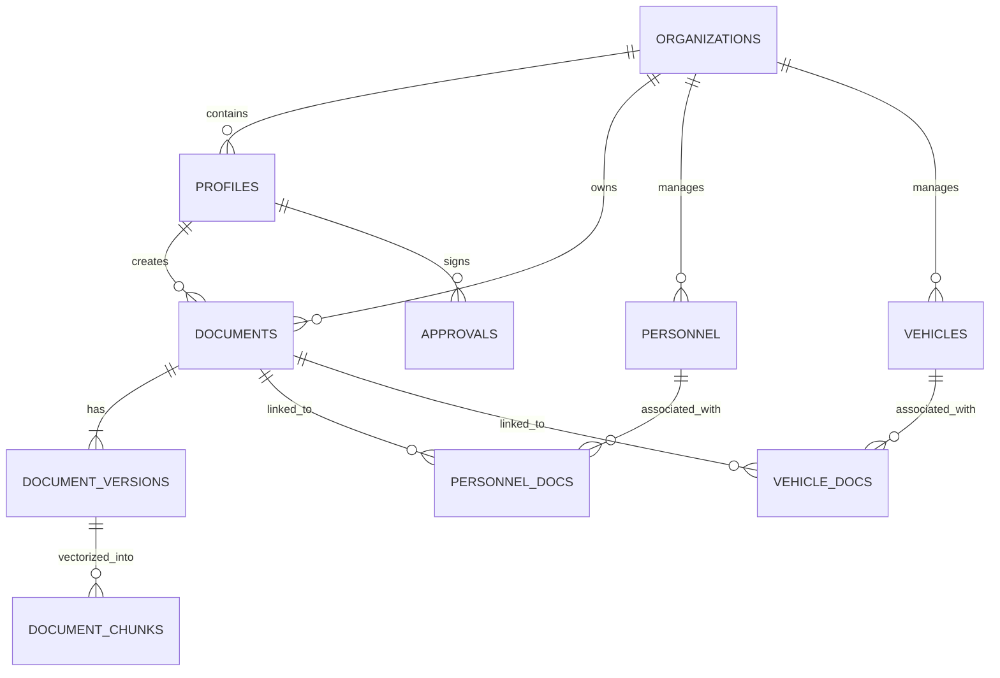

# 🗄️ Documentación Maestra de Base de Datos - Strategic Connex

**Versión:** 2.5 (Enterprise Premium)  
**Estado:** Production-Ready  
**Arquitecto:** Principal Systems Architect (AI)

---

## 🧱 1. Resumen Ejecutivo
La base de datos de Strategic Connex está diseñada bajo un paradigma **Multi-tenant** estricto, utilizando PostgreSQL (Supabase) como motor principal. El sistema integra capacidades avanzadas de **Búsqueda Semántica (RAG)** mediante `pgvector`, trazabilidad inmutable de auditoría y una capa de seguridad basada en **Row Level Security (RLS)** que garantiza el aislamiento total de datos entre organizaciones.

## 🏗️ 2. Arquitectura de Datos
*   **Aislamiento:** Filtrado por `org_id` en todas las entidades críticas.
*   **Integridad Documental:** Sistema de versionado con hashes SHA-256 y firmas digitales.
*   **Inteligencia:** Capa RAG con embeddings de 1536 dimensiones para auditoría asistida por IA.
*   **Extensibilidad:** Uso intensivo de `JSONB` para metadata dinámica según el tipo de documento.

## 📊 3. Modelo de Datos (ERD)



---

## 📖 4. Diccionario de Datos

### 4.1. Core: Gestión de Identidad y Tenants
| Tabla | Descripción | Campos Clave |
| :--- | :--- | :--- |
| `organizations` | Tenants del sistema (Empresas/Proveedores). | `id`, `slug`, `is_vendor`, `parent_org_id` |
| `profiles` | Usuarios vinculados a Auth y Orgs. | `id` (FK Auth), `role`, `permissions` |

### 4.2. DMS: Gestión Documental
| Tabla | Descripción | Campos Clave |
| :--- | :--- | :--- |
| `documents` | Entidad principal de documentos. | `org_id`, `status`, `expiry_date`, `current_version` |
| `document_versions` | Histórico inmutable de archivos. | `document_id`, `file_url`, `version_number` |
| `document_types` | Configuración de tipos de documentos. | `name`, `required_metadata` |

### 4.3. Operaciones: Activos y Personal
| Tabla | Descripción | Campos Clave |
| :--- | :--- | :--- |
| `personnel` | Registro de empleados/contratistas. | `cuil`, `status`, `org_id` |
| `vehicles` | Flota vehicular vinculada. | `license_plate`, `status` |
| `personnel_docs` | Relación Personal ↔ Documento. | `expiry_date`, `status` |

### 4.4. Inteligencia, Auditoría y Telemetría
| Tabla | Descripción | Campos Clave |
| :--- | :--- | :--- |
| `document_chunks` | Fragmentos para búsqueda vectorial. | `embedding (vector)`, `content` |
| `digital_signatures` | Evidencia legal de aprobaciones. | `signature_hash`, `validation_provider` |
| `audit_logs` | Registro inmutable de eventos. | `action`, `entity_type`, `old_data`, `new_data` |
| `ai_call_logs` | Telemetría de la capa POL. | `provider`, `model`, `tokens`, `duration_ms` |
| `api_keys` | Gestión de llaves externas. | `key_hint`, `encrypted_key`, `expires_at` |
| `contracts` | Seguimiento de contratos comerciales. | `vendor_id`, `start_date`, `value_amount` |
| `notifications` | Sistema de alertas para usuarios. | `type`, `is_read`, `link` |
| `qa_logs` | Historial del motor de Q&A. | `question`, `answer`, `feedback_score` |
| `risk_score_history` | Evolución de riesgo por activo. | `entity_type`, `score`, `reason` |

---

## 🔐 5. Seguridad y Compliance
### 5.1. Row Level Security (RLS) - Activo
El sistema implementa un **aislamiento dinámico total** mediante Row Level Security. A diferencia de implementaciones estáticas, SC Platform utiliza una función de seguridad definida (`get_my_org_id()`) que se inyecta en todas las tablas que poseen la columna `org_id`.

```sql
-- Política Maestra Aplicada Dinámicamente
CREATE POLICY "Org Isolation" ON [TABLA] 
FOR ALL USING (org_id = get_my_org_id());
```

### 5.2. Trazabilidad Inmutable (Auditoría por Triggers)
La auditoría no depende de la capa de aplicación. Se ha implementado el trigger `process_audit_log()` que captura automáticamente cualquier operación de `INSERT`, `UPDATE` o `DELETE` a nivel de base de datos, garantizando que el rastro de auditoría sea imposible de eludir.

---

## ⚙️ 6. Automatizaciones y Performance
### 6.1. Triggers Activos
*   **`handle_updated_at`**: Garantiza la integridad de los timestamps en todas las tablas operativas.
*   **`trg_audit_docs`**: Captura automática de cambios en la tabla maestra de documentos.
*   **`trg_audit_personnel` / `trg_audit_vehicles`**: Auditoría de activos críticos.

### 6.2. Índices de Búsqueda Semántica (RAG)
Se ha configurado el índice **HNSW** (`idx_chunks_embedding`) sobre la tabla `document_chunks`, optimizando las búsquedas de similitud de coseno para que operen en escala sub-segundo incluso con millones de fragmentos.

---

## 🚀 7. Estrategia de Mantenimiento
*   **Backups:** Snapshots diarios vía Supabase.
*   **Migrations:** Control de versiones estricto en `/supabase/migrations`.
*   **Scaling:** Particionamiento horizontal de `audit_logs` proyectado para >1M registros.
